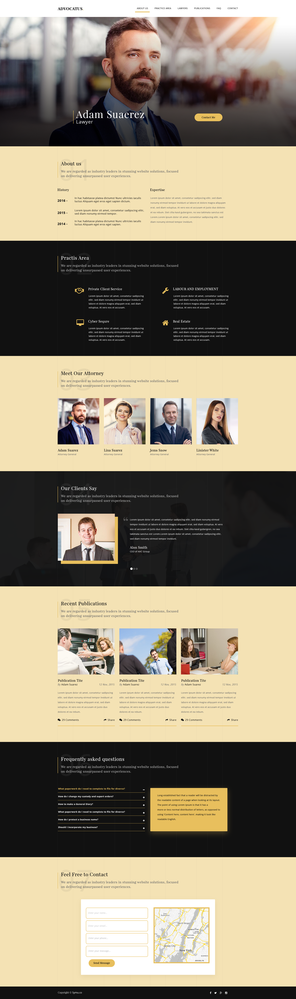

# Advocatus-Template-HTML

> Projet d'intégration web 2018

## Instructions

Sur la base d'une maquette graphique choisie, concevoir en version responsive 3 tailles différentes selon le dispositif visé : grand écran, tablette et smartphone.

Procéder en trois étapes :

1) Découpage de maquette, séparation des contenus, conception des éléments graphiques.
2) Intégration de page en HTML5 et CSS3 dans le respect des standards du web.
3) Vérification de compatibilité entre les différents navigateurs (Firefox, Chrome,Safari, IE) sur les différentes plateformes (PC/Windows, Mac/iOS, Android).

* Utiliser les sprites CSS pour les réseaux sociaux.
* Pour l'intégration d'un formulaire de contact.
* Ajouter une carte avec l'API Google Maps.
* Créer l'effet JS de Smooth Scroll (défilement élastique) sur la page.

## Régles

* Un fichier index.html à la racine.
* Un dossier css pour les fichiers CSS, un dossier img pour les images.
* Un dossier js pour les fichiers JavaScript.
* Tous les fichiers HTML doivent être à la racine du dossier.
* Vos fichiers HTML devront tous avoir une structure HTML valide (doctype présent, pas de balises non fermées, etc.)

## Livrables

Le livrable devra être un zip contenant l’intégralité des fichiers (Les fichiers pourront être hébergés sur un serveur pour être visibles directement sur internet).

## Démo

[Lien](https://abdessalam98.github.io/Advocatus-Template-HTML/)

## Auteur

[Abdessalam BENHARIRA](https://github.com/Abdessalam98/)
